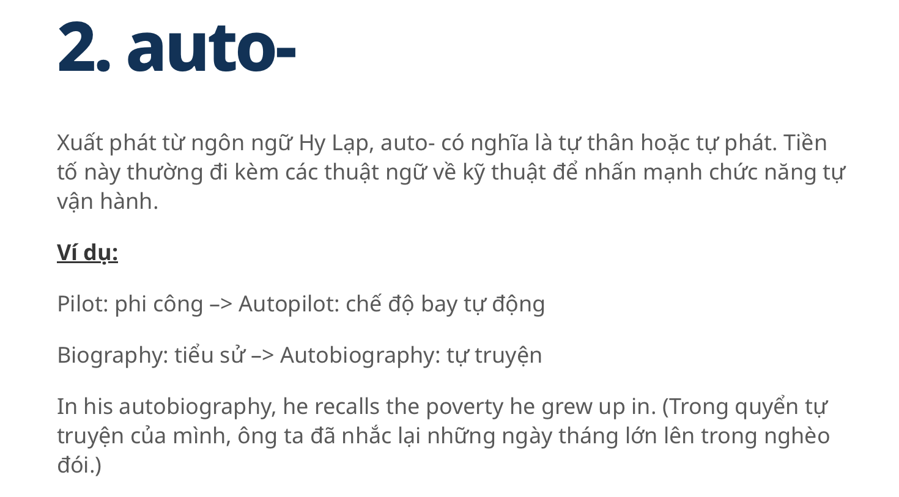

# English for Computer Science (CSE803001-5-1-24(N03))  


Materials for the Class of CSE803001-5-1-24(N03)
# Lecturing about CPU ([Computer] Central Processing Unit)

## Brief Introduction

###  The Look 
Some of the  CPUs up to 2025.

M4 Max features a 16-core CPU that’s up to 2.2x faster than the CPU in M1 Max, and up to 2.5x faster than the latest AI PC chip


Sourced: M4 Max by Apple (Apple.com, 2025)

| Intel           |Back | Front|
| :---------------- | :------: | ----: |
| Intel Core 9|      |   |
| Intel 14th gen| Support for the Intel® 700 series chipsets and backward compatibility with the Intel® 600 series chipsets allow you to access the features you need for any task.  | This architecture features performance cores, Efficient-cores and Intel® Thread Director2. With up to 24 cores (8 Performance-cores and 16 Efficient-cores) and up to 32 threads. The Intel® Core i9 processor P-cores are capable of reaching 6.0 GHz with Intel® Thermal Velocity Boost3 4 to elevate performance.|

Source: Intel® Core™ Desktop Processors by Intel (Intel.com, 2025)

## The History 


## The current to Study

### The Best CPUs for 2025

| The Best CPUs for 2025            | Mainstream, Budget, Fast-end| Game|
| :---------------- | :------: | ----: |
| Interms of Mainstream, Budget, Fast-end, Game|      |   |


### zProcessing Apporach and on Semiconduction


Sourced: Hutton, D. (2024). IBM Z/LinuxONE System Processor Optimization Primer.

### Core & Chip Level


```
Moore's law
is the observation that the number of transistors in an integrated circuit (IC) doubles about every two years.
Moore's law is an observation and projection of a historical trend.
Rather than a law of physics, it is an empirical relationship.
It is an experience-curve law, a type of law quantifying efficiency gains from experience in production.

```

Sourced: Hutton, D. (2024). IBM Z/LinuxONE System Processor Optimization Primer.

# Required Reading Materials: MAINFRAMES

Hutton, D. (2024). IBM Z/LinuxONE System Processor Optimization Primer.

[Mainframe IBM 360](https://www.ibm.com/history/system-360)

[Real Time AI for Transaction Processing at Scale and Industry Firt Quantum Safe System](https://newsroom.ibm.com/2022-04-05-Announcing-IBM-z16-Real-time-AI-for-Transaction-Processing-at-Scale-and-Industrys-First-Quantum-Safe-System)


# Listening Materials: MainFrame


## Mainframe brief Introduction

[](https://www.youtube.com/watch?v=ximv-PwAKnc)


  
  
# Writting 
## Technique

This new strategic technique is called the Power strategy. 
This strategy contains the following steps:

1. "P" which stands for picking ideas. In this stage, students are asked to think of what they are writing and this stage is considered to be pre-writing stage then students write freely and then choose the most important ideas to write about.
   
2. "O" refers to organizing ideas. In this stage, students put their ideas into well-organized order according to the sequence and the importance of the ideas.
   
3. "W" stands for writing and this stage is the stage of actual writing to what had been arranged before.
   
4. "E" means evaluating what had been written according to a writing rubric see appendix (A) and your supporting/evidence/experiment results.
   
5. "R" means re-examining and rereading what had been written to make sure of its quality.


   

## Short_paper

<h1>Writing Materials: Mainframe</h1>

```
What is the Moore's law applying in the current IBM Z/LinuxONE Mainframe ? How can clients infuse AI inferencing for real-time insights on IBM zSeries-the z16 2022 ?

Hutton, D. (2024) said "Moore’s Law is not dead yet, though we can see the checkered flag on the GPS” and "clients can infuse AI inferencing for real-time insights" on IBM zSeries-the z16 2022. 


Please write a short paper to explain and discuss these points of view and its applied technology. 

Reference:  Hutton, D. (2024). IBM Z/LinuxONE System Processor Optimization Primer.

```


# Vocabulary
 
   Look up the vocabulary and Explanation.
   Example

| Words            | Meaning | Category|
| :---------------- | :------: | ----: |
| Mainframes |     |  |
| Core-level|     |  |
| Chip-level|     |  |
| Real-time |     |  |
| microarchitectural |     |  |
| infuse AI inferencing for real-time insights |     |  |
| quantum-safe system |    |  |
| stochastic [stəˈkastik]|     |  |
| behaviour  |     |  |
| Millicode |    |  |
| ultra-high frequency pipeline design |     |  |
| self-modifying code |     |  |
| random graph |     |  |
| bipartite [bīˈpärˌtīt] graph |     |  |
| High-Level understanding of the microprocessor core |     |  |
| Branch Prediction Unit |     |  |
| On-chip Core Co-Processor|     |  |
| On-chip Integrated Deflate Accelerator|     |  |
| On-chip Integrated Artificial Intelligence Accelerator |     |  |
| zero downtime|     |  |
| redundancy|     |  |
| seemlessly|     |  |
| |     |  |
| |     |  |
| |     |  |

# Speaking materials: Mainframes [Practice]
## Conversation


3.1 Conversation: the breakthrough of current trends in Mainframe's industry

| Name            | Role | Conversation|
| :---------------- | :------: | ----: |
| Nhat | Listener   |  |
| Lan |  Speaker about current mainframe   |  |
| Duyen |     | Friend to share Conversation |


3.2 Convesation: Now mentioning about IBM Z/LinuxOne System, and its advance.

| Name            | Role | Conversation|
| :---------------- | :------: | ----: |
| Bao | Listener    |  |
| Van |     | Speaker about IBM Z/LinuxONE System |

# Comprehensive / Advanced Exercises

# Grammar Lesson

Prefix in English (Tiền tố trong tiếng Anh)

| Prefix/Meaning            |Prefix/Meaning | Prefix/Meaning|
| :---------------- | :------: | ----: |
|  |      |   |
|  |      |   |
|  |      |   |
|  |      |   |
|  |      |   |

| more... |  


# Reference

1. John Burek & Michael Justin Allen Sexton, 2024.  "The Best CPUs for 2025". Retrieved from https://www.pcmag.com/picks/the-best-cpus
2. Apple.com, 2025. "M4 Max". Retrieved from https://www.apple.com/newsroom/2024/10/apple-introduces-m4-pro-and-m4-max/
3. Intel.com, 2025. "Intel® Core™ Desktop Processors" Retrieved from https://www.intel.com/content/www/us/en/products/docs/processors/core/core-14th-gen-desktop-brief.html

# Hanoi, January 2025  
