# English for Computer Science (CSE803001-5-1-24(N03))  


Materials for the Class of CSE803001-5-1-24(N03)

# Hardware & Software
Reading Materials

[Software and Hardware](Computer/HistoryofComputers.pdf)

Added Video for Understanding


[](https://www.youtube.com/watch?v=vG_qmtdBPTU)

[](https://www.youtube.com/watch?v=fTMMsreAqX0)

Purpose:
+ Scanning
  
+ Skimming
  
+ Understanding
  
  ++ Main idea
  
  ++ True/False
  
# Writting

```
The unpredictable phenomena of emergent abilities of large language model.
Model can generalize to random unseen compositions of some level of unpredictable abilities or skills. Other phenomena that we probably are not aware of, and we need some understanding of that. Language models can move beyond being stochastic parrots. For example, Chat bot had some level of understanding but do these abilities reflect actual understanding? Otherwise, model simply repeat its training data like so called stochastic parrots. 


Please write a short paper to overview of these above points in the 2024's Biggest Breakthroughs in Computer Science.

```


# Vocabulary
 
   Look up the vocabulary and Explanation.
   Example

| Words            | Meaning | Category|
| :---------------- | :------: | ----: |
| Rod |     |  |
| Apparatus |     |  |
| Punch cards |     |  |
| circuitry |     |  |
| magnetic drums |    |  |
| batch operating systems |     |  |
| integrated circuit (IC)  |     |  |
| superconductors |    |  |
| cruncher |     |  |
| calculator |     |  |
| Dynamic Access Memory |    |  |
| Ethernet |    |  |
| Spreadsheet program |    |  |
| Laptop  |    |  |
| wireless fidelity  |    |  |
| Elastic Cloud  |    |  |
| Analog Computers  |    |  |
| Digital Computers  |    |  |
| Mainframe Computers  |    |  |
| SuperComputers  |    |  |
| MiniComputers  |    |  |
| MicreComputers  |    |  |
| Embedded Processors  |    |  |
| Vacuum Tube |    |  |
| Transistor  |    |  |
| Conduction/Conductor  |    |  |
| Superconductor  |    |  |
| Semiconductor  |    |  |
# Practice
## Conversation


3.1 Conversation: the computer is working - now to learn Windows 10

| Name            | Role | Conversation|
| :---------------- | :------: | ----: |
| Nhat | Computer User   |  |
| Lan |  Computer User   |  |
| Duyen |     | Friend to share Conversation |


3.2 Convesation: the computer is working - now to learn Windows 10

| Name            | Role | Conversation|
| :---------------- | :------: | ----: |
| Bao | Computer Buyer /Customer    |  |
| Van |     | Friend to share conversation |

# Comprehensive / Advanced Exercises

# Grammar Lesson

Prefix in English (Tiền tố trong tiếng Anh)

| Prefix/Meaning            |Prefix/Meaning | Prefix/Meaning|
| :---------------- | :------: | ----: |
|  |      |  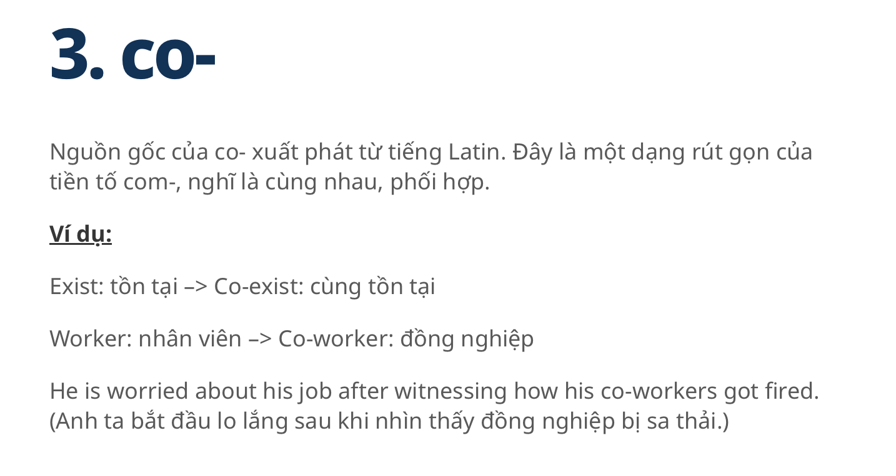 |
| 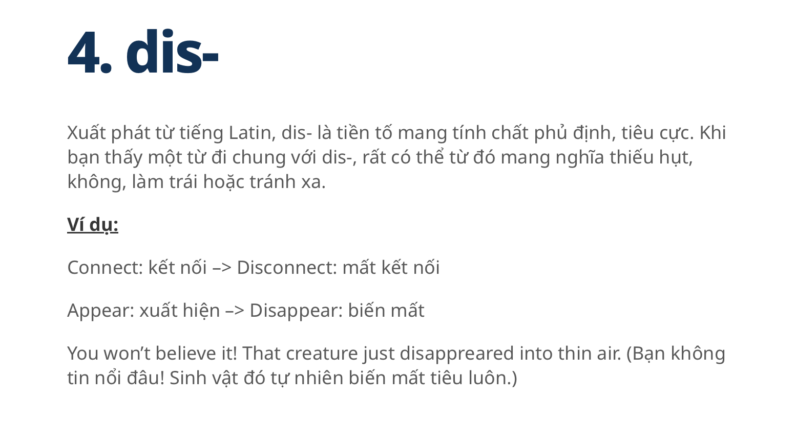 | 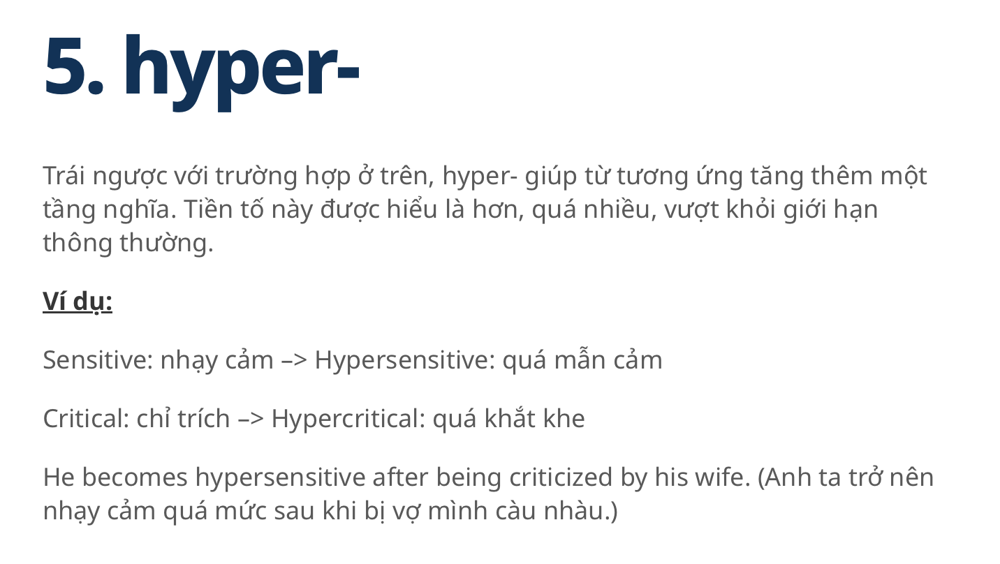     |  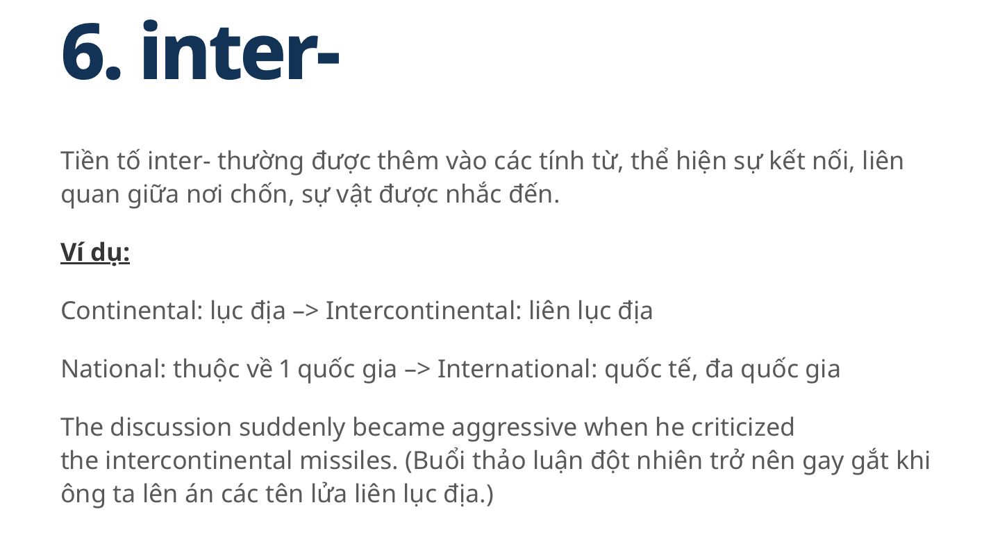 |
| 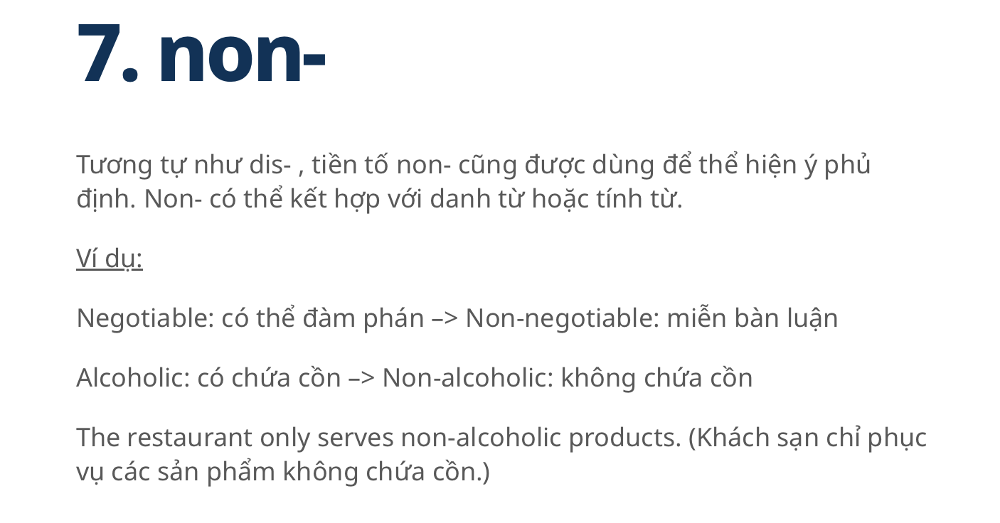 | 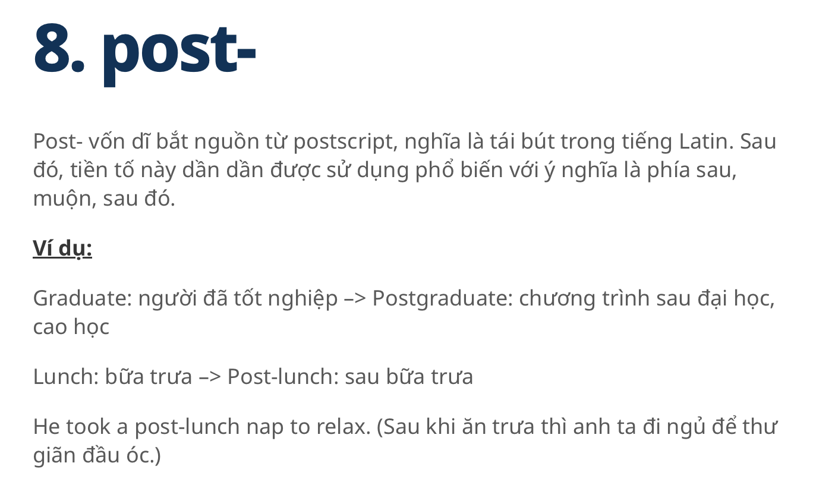     |  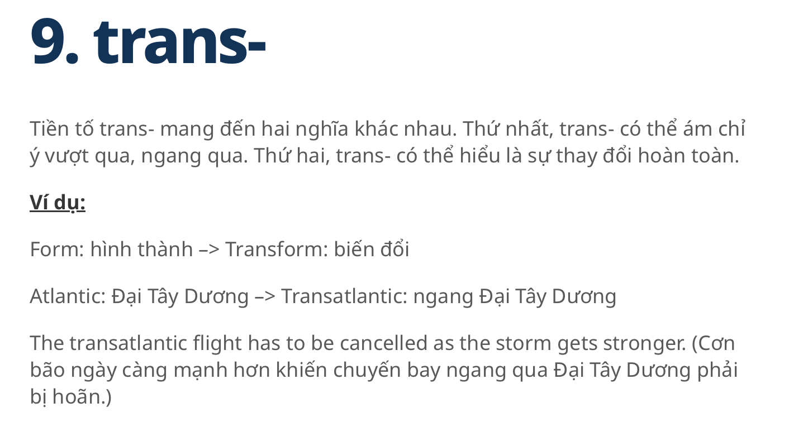 |
| 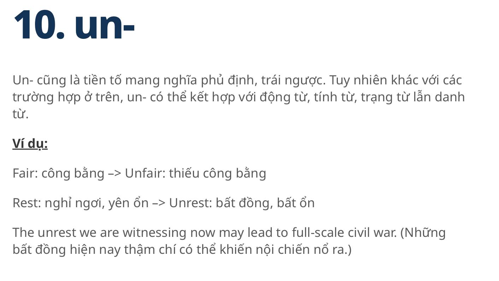 | 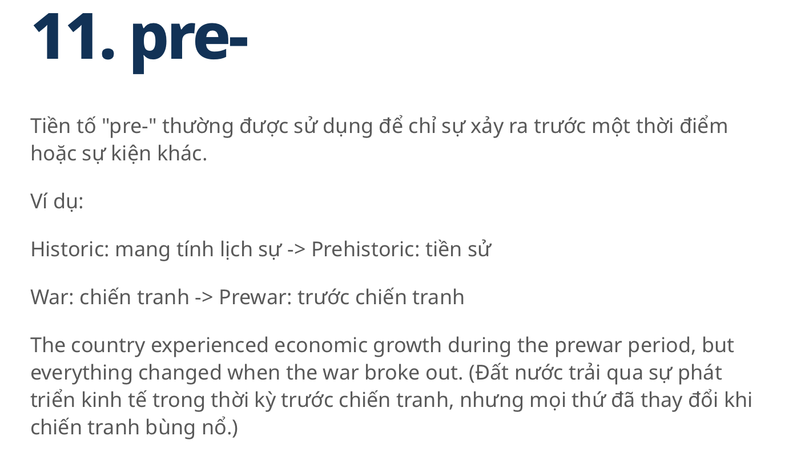     |  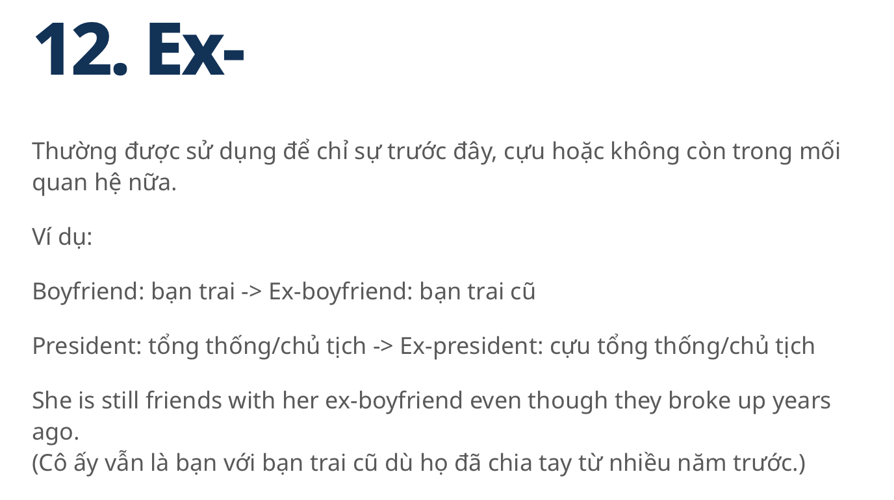 |
| 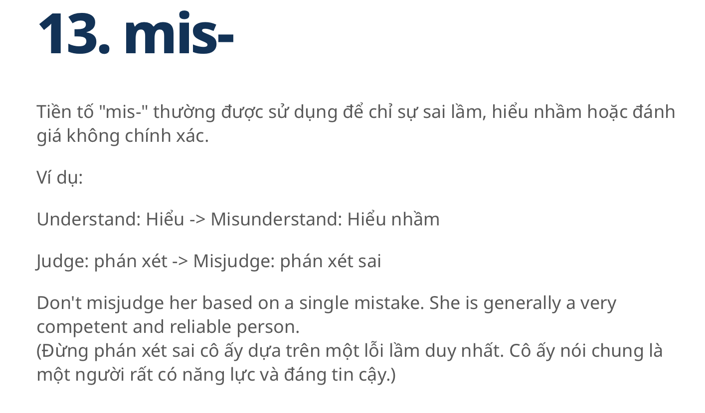 | 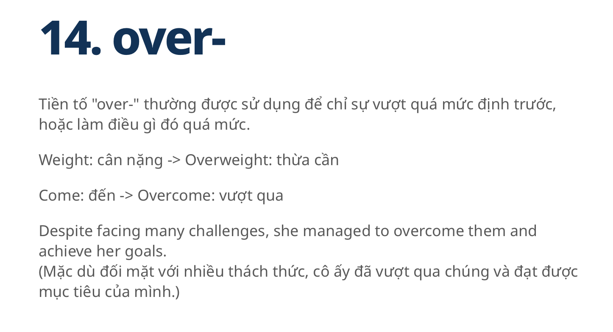     |  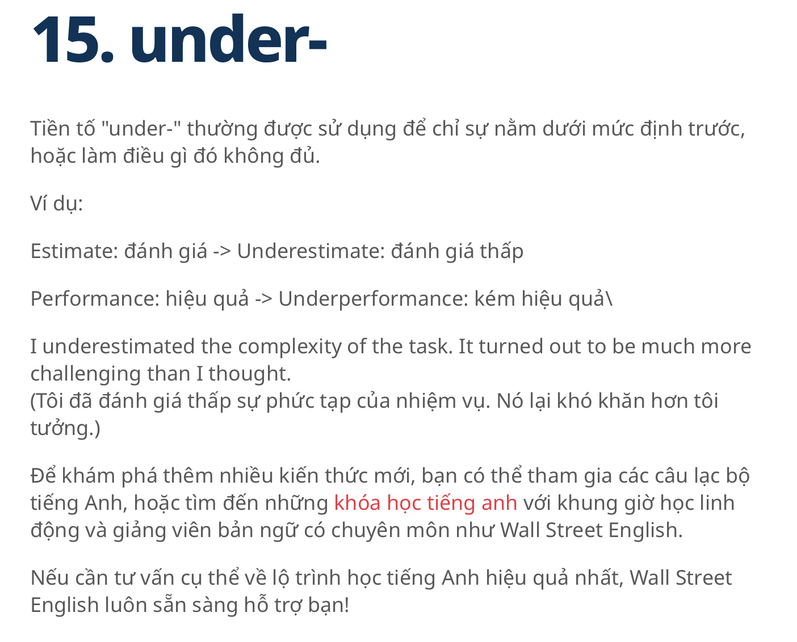 |

| more... |  


# Hanoi, January 2025  
