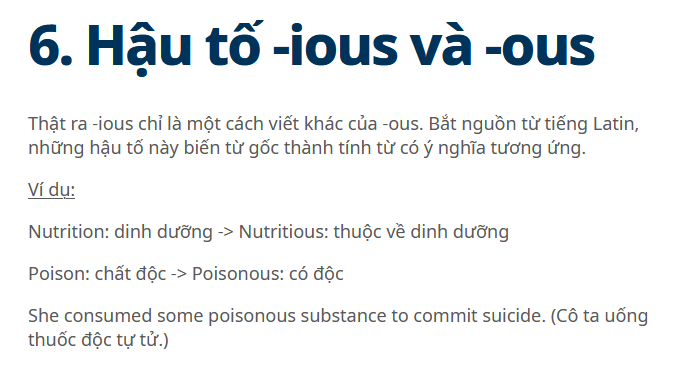

# English for Computer Science (CSE803001-5-1-24(N03))  

Materials for the Class of CSE803001-5-1-24(N03)

# The History of Computer
Reading Materials

[History of Computer](Computer/HistoryofComputers.pdf)

Added Video for Understanding

Purpose:
+ Scanning
  
+ Skimming
  
+ Understanding
  
  ++ Main idea
  
  ++ True/False
  

# Vocabulary
 
   Look up the vocabulary and Explanation.
   Example

| Words            | Meaning | Category|
| :---------------- | :------: | ----: |
| Rod |     |  |
| Apparatus |     |  |
| Punch cards |     |  |
| circuitry |     |  |
| magnetic drums |    |  |
| batch operating systems |     |  |
| integrated circuit (IC)  |     |  |
| superconductors |    |  |
| cruncher |     |  |
| calculator |     |  |
| Dynamic Access Memory |    |  |
| Ethernet |    |  |
| Spreadsheet program |    |  |
| Laptop  |    |  |
| wireless fidelity  |    |  |
| Elastic Cloud  |    |  |
| Analog Computers  |    |  |
| Digital Computers  |    |  |
| Mainframe Computers  |    |  |
| SuperComputers  |    |  |
| MiniComputers  |    |  |
| MicreComputers  |    |  |
| Embedded Processors  |    |  |
| Vacuum Tube |    |  |
| Transistor  |    |  |
| Conduction/Conductor  |    |  |
| Superconductor  |    |  |
# Practice
## Conversation

3.1 Jim is at a store
buying a computer

| Name            | Role | Conversation|
| :---------------- | :------: | ----: |
| Nhat | Computer Buyer /Customer    |  |
| Lan |  Computer Buyer /Customer   |  |
| Duyen |     | Sale person |

3.2 Printer

 Convesation: Buy a Printer at FPT Computer Shop

| Name            | Role | Conversation|
| :---------------- | :------: | ----: |
| Bao | Printer Buyer /Customer    |  |
| Van |     | Sale person |

# Comprehensive / Advanced Exercises

# Grammar Lesson

Ending in English (Hậu tố trong tiếng Anh)

| Ending/Meaning            | Ending/Meaning | Ending/Meaning|
| :---------------- | :------: | ----: |
|  |      |   |
|  |      |   |
|  |      |   |
|  |      |   |
|  |      |   |
|  |      |   |
|  |      |   |
| more... |  

# Hanoi, December 2024  
