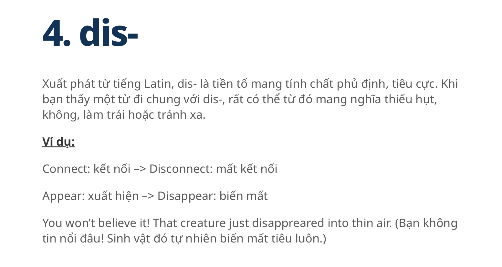
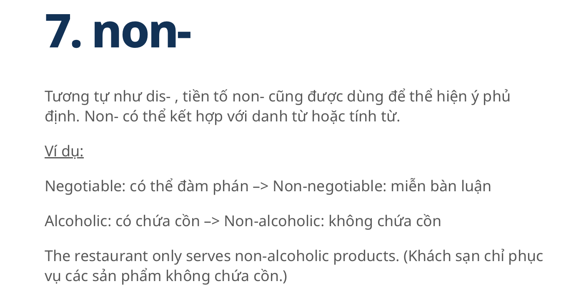
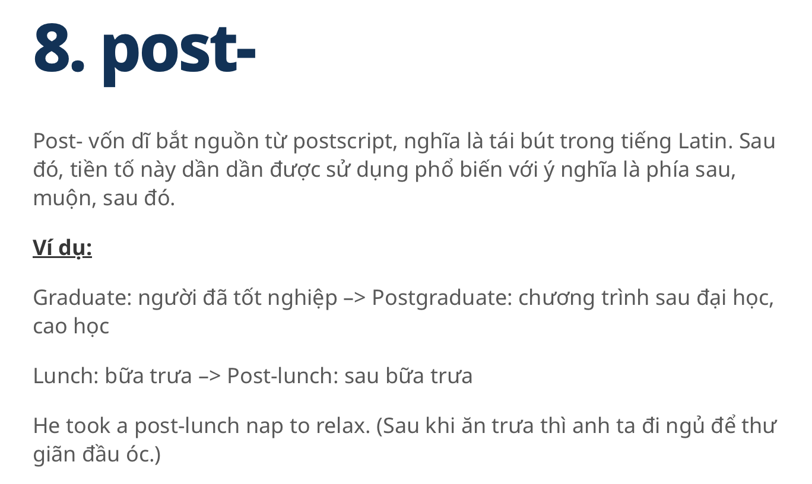
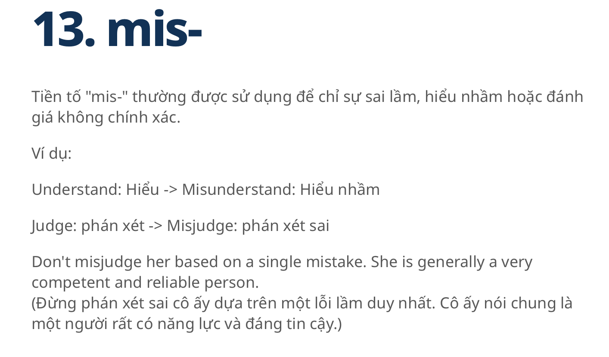

# English for Computer Science (CSE803001-5-1-24(N03))  


Materials for the Class of CSE803001-5-1-24(N03)
# Lecturing about MAINFRAME

## Brief Introduction

Mainframes are data servers that are designed to process up to 1 trillion web transactions daily with the highest levels of security and reliability

At their core, mainframes are high-performance computers with large amounts of memory and data processors that process billions of simple calculations and transactions in real-time. 

A mainframe computer is critical to commercial databases, transaction servers and applications that require high resiliency, security and agility.


```
The term mainframe initially referred to the large cabinet or ‘main frame’ that held the central processing unit (CPU) of early computer systems.
The mainframe served as a central data repository or ‘hub’ that links workstations or terminals in an organization’s data processing center.
A centralized computing environment has given way to a more distributed computing environment as mainframes became smaller and gained more processing power to be more flexible and multipurpose.
Today’s mainframes process and store massive amounts of data and are called enterprise servers (or data servers).


```

## The Look 


Sourced: Mainframe in Viettel Datacenter by Viettel

## The History 

### Harvard Mark I 1937

Designed in 1937, the Harvard Mark I, or IBM Automatic Sequence Controlled Calculator


Sourced: Harvard University

### IBM System/360
The first modern mainframe, the IBM System/360, hit the market in 1964. Within two years, the System/360 dominated the mainframe computer market as the industry standard.


Sourced: IBM

### IBM zSeries-the z16 2022

Mainframe is as a core IT infrastructure across industries. 
In April 2022, IBM unveiled the latest generation of the IBM zSeries—the z16:


IBM zSeries—the z16
+ IBM Telum™ processor with industry-first,
<b>ON-CHIP</b> integrated accelerators to predict and automate with AI at unprecedented speed and scale
(and with extremely low latency

```
Announcing IBM z16:
Real-time AI for Transaction Processing at Scale and Industry's First Quantum-Safe System

- IBM z16 integrates the IBM Telum processor so clients can infuse AI inferencing for real-time insights
- IBM z16 is the industry's first quantum-safe system(1)

```
Citation: [Real Time AI for Transaction Processing at Scale and Industry Firt Quantum Safe System](https://newsroom.ibm.com/2022-04-05-Announcing-IBM-z16-Real-time-AI-for-Transaction-Processing-at-Scale-and-Industrys-First-Quantum-Safe-System)

Soucrced: IBM
IBM zSeries—the z16

## The current to Study

### The trend of AI and Quantum in Mainframe

- IBM z16 integrates the IBM Telum processor so <b>clients can infuse AI inferencing for real-time insights<b>
- IBM z16 is the industry's first quantum-<b>safe</b> system(1)

### zProcessing Apporach and on Semiconduction


Sourced: Hutton, D. (2024). IBM Z/LinuxONE System Processor Optimization Primer.

### Core & Chip Level


```
Moore's law
is the observation that the number of transistors in an integrated circuit (IC) doubles about every two years.
Moore's law is an observation and projection of a historical trend.
Rather than a law of physics, it is an empirical relationship.
It is an experience-curve law, a type of law quantifying efficiency gains from experience in production.

```

Sourced: Hutton, D. (2024). IBM Z/LinuxONE System Processor Optimization Primer.

# Required Reading Materials: MAINFRAMES

Hutton, D. (2024). IBM Z/LinuxONE System Processor Optimization Primer.

[Mainframe IBM 360](https://www.ibm.com/history/system-360)

[Real Time AI for Transaction Processing at Scale and Industry Firt Quantum Safe System](https://newsroom.ibm.com/2022-04-05-Announcing-IBM-z16-Real-time-AI-for-Transaction-Processing-at-Scale-and-Industrys-First-Quantum-Safe-System)


# Listening Materials: MainFrame


## Mainframe brief Introduction

[](https://www.youtube.com/watch?v=ximv-PwAKnc)


  
  
# Writting 
## Technique

This new strategic technique is called the Power strategy. 
This strategy contains the following steps:

1. "P" which stands for picking ideas. In this stage, students are asked to think of what they are writing and this stage is considered to be pre-writing stage then students write freely and then choose the most important ideas to write about.
   
2. "O" refers to organizing ideas. In this stage, students put their ideas into well-organized order according to the sequence and the importance of the ideas.
   
3. "W" stands for writing and this stage is the stage of actual writing to what had been arranged before.
   
4. "E" means evaluating what had been written according to a writing rubric see appendix (A) and your supporting/evidence/experiment results.
   
5. "R" means re-examining and rereading what had been written to make sure of its quality.


   

## Short_paper

<h1>Writing Materials: Mainframe</h1>

```
What is the Moore's law applying in the current IBM Z/LinuxONE Mainframe ? How can clients infuse AI inferencing for real-time insights on IBM zSeries-the z16 2022 ?

Hutton, D. (2024) said "Moore’s Law is not dead yet, though we can see the checkered flag on the GPS” and "clients can infuse AI inferencing for real-time insights" on IBM zSeries-the z16 2022. 


Please write a short paper to explain and discuss these points of view and its applied technology. 

Reference:  Hutton, D. (2024). IBM Z/LinuxONE System Processor Optimization Primer.

```


# Vocabulary
 
   Look up the vocabulary and Explanation.
   Example

| Words            | Meaning | Category|
| :---------------- | :------: | ----: |
| Mainframes |     |  |
| Core-level|     |  |
| Chip-level|     |  |
| Real-time |     |  |
| microarchitectural |     |  |
| infuse AI inferencing for real-time insights |     |  |
| quantum-safe system |    |  |
| stochastic [stəˈkastik]|     |  |
| behaviour  |     |  |
| Millicode |    |  |
| ultra-high frequency pipeline design |     |  |
| self-modifying code |     |  |
| random graph |     |  |
| bipartite [bīˈpärˌtīt] graph |     |  |
| High-Level understanding of the microprocessor core |     |  |
| Branch Prediction Unit |     |  |
| On-chip Core Co-Processor|     |  |
| On-chip Integrated Deflate Accelerator|     |  |
| On-chip Integrated Artificial Intelligence Accelerator |     |  |
| |     |  |
| |     |  |
| |     |  |
# Speaking materials: Hardware and Software [Practice]
## Conversation


3.1 Conversation: the breakthrough of current trends in Mainframe's industry

| Name            | Role | Conversation|
| :---------------- | :------: | ----: |
| Nhat | Listener   |  |
| Lan |  Speaker about current mainframe   |  |
| Duyen |     | Friend to share Conversation |


3.2 Convesation: Now mentioning about IBM Z/LinuxOne System, and its advance.

| Name            | Role | Conversation|
| :---------------- | :------: | ----: |
| Bao | Listener    |  |
| Van |     | Speaker about IBM Z/LinuxONE System |

# Comprehensive / Advanced Exercises

# Grammar Lesson

Prefix in English (Tiền tố trong tiếng Anh)

| Prefix/Meaning            |Prefix/Meaning | Prefix/Meaning|
| :---------------- | :------: | ----: |
|  |      |   |
|  |      |   |
|  |      |   |
|  |      |   |
|  |      |   |

| more... |  


# Hanoi, January 2025  
