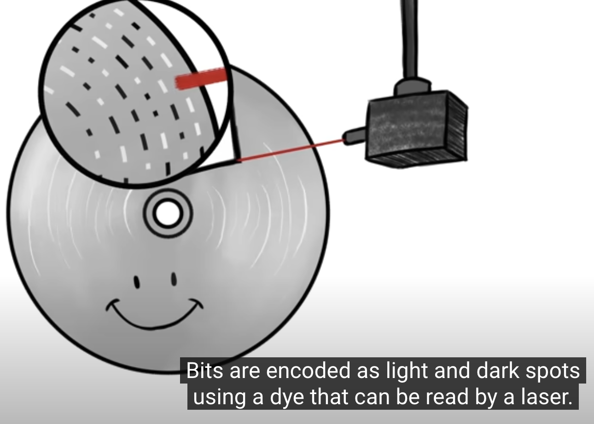

# English for Computer Science (CSE803001-5-1-24(N03))  


Materials for the Class of CSE803001-5-1-24(N03)
# Part I. Lecturing about Memory
## 1. Brief Introduction


### Definition


|Squences| In          | Action | 
| :---------------- | :------: | :------: | 
||      |  |
||      |  |
||      |  |
||      |  |
| more... |

### Electronic Design

Memory is an Electronic holding place for the instructions and data.
It is used by the computer's operating system, hardware, and software.

#### An Example of RAM (Random Access Memory)Circuit


+ <b>Capacitor</b>


  
A capacitor  stores an electrical charge that represents a 1 or 0.

The capacitor is part of a memory cell that also contains a transistor. 

+ <b>Transistor</b>

  

  Transistors are used in RAM  as switches to read and change the state of capacitors that store data

+ <b> Resistor</b>
  


  a type of passive electrical device that can change its resistance based on the history of voltage or current applied to it.
  
  Essentially, it is a non-volatile memory element that retains its state even when the power is turned off.
  

### Classification


#### Primary Memory
   
Located directly on microchips on the motherboard that are physically close to a computer's microprocessor.

Memory is used as a synonym for primary memory 

For example: RAM

#### Secondary Memory (Second storage device)

For example: A hard drive or a hard disk drive (HDD) or USB
   
|Hardisk| Optical based Storage (DVD and Blu-ray)          | USB/Stick Float Gate Transitors | 
| :---------------- | :------: | :------: | 
|Magnetic storage. Data is stored as a magnetic pattern on a spinning disc coated with magnetic film| Bits are encoded as light and dark spots using a dye that can be read by laser| Store bits by trapping or removing electrical charges |
||      |  |


### Comparision

|Items| Primary Memory           | Secondary Memory [Storage] | 
| :---------------- | :------: | :------: | 
|Data storage|     volatile| nonvolatile |
||    Short time  | Long Time |
||    Gone after power-off  | Remain |
|Performance| Fast|Slow|


## 2. Future of Memory


Current technologies, the data in the memory can last for 10 years

```
Scientists are working to exploit the physical properties of materials
down to the level of quantum and more durable


Neuromorphic computation for higher energy efficiency and superb parallelism in big data processing.

All-circuit AI chip

More hardware-oriented state-of-the-art neuromorphic chips 

Quantum-well charge-trap synaptic transistor 


```


# Part II. Required Reading Materials: Memory


Volatile and Nonvolatile Memory Devices for Neuromorphic and Processing-in-memory Applications in JOURNAL OF SEMICONDUCTOR TECHNOLOGY


Cho, Seongjae. "Volatile and nonvolatile memory devices for neuromorphic and processing-in-memory applications." J. Semicond. Technol. Sci 22, no. 1 (2022): 30-46.

+  Neuromorphic computing architectures are specifically designed for higher energy efficiency and superb parallelism in big data processing.

+  All-circuit AI chip

+ More hardware-oriented state-of-the-art neuromorphic chips have been incessantly released with the full Si CMOS processing compatibility

+ Quantum-well charge-trap synaptic transistor 

# Part III. Listening Materials: Memory


## Memory Brief Introduction

[](https://www.youtube.com/watch?v=H_M--weEzpA&t=119s)

[](https://www.youtube.com/watch?v=p3q5zWCw8J4&list=PPSV&t=30s)


# Part III. Writing 
## Writing Technique of POWER

This new strategic technique is called the Power strategy. 
This strategy contains the following steps:

1. "P" which stands for picking ideas. In this stage, students are asked to think of what they are writing and this stage is considered to be pre-writing stage then students write freely and then choose the most important ideas to write about.
   
2. "O" refers to organizing ideas. In this stage, students put their ideas into well-organized order according to the sequence and the importance of the ideas.
   
3. "W" stands for writing and this stage is the stage of actual writing to what had been arranged before.
   
4. "E" means evaluating what had been written according to a writing rubric see appendix (A) and your supporting/evidence/experiment results.
   
5. "R" means re-examining and rereading what had been written to make sure of its quality.


   
## Writing Technique of Tone (Zobel, Justin, 2005)

+ Objective
  
+ Accurate
  
## Writing Technique of Good Style (Zobel, Justin, 2005).

+ Tone (Objective and Accurate)
+ Examples
+ Motivation
+ Balance
+ Voice (Active)
+ Reference and Citation

## Writing Avoidance
+ Straw man
+ Analogies
+ Obfuscation (Ambiguous)
+ The upper hand
  


## Short_paper

<h1>Writing Materials: Memory</h1>

"The semiconductor memories let aside the advancements in processor technologies now is being moved to the
center of renovation toward the future computers in the ultimate architecture. In his review, the roles and requirements of semiconductor memories for memory-oriented processors are investigated in the highlights of applications in the neuromorphic system
and processing-in-memory architectures (Seongjae, 2022).

Seongjae (2022) has reviewed some main points as below:

+ Architecture of a CNN accelerator with DRAM

+ Si-based floating-body synaptic transistor 

+ Quantum-well charge-trap synaptic transistor

+ Device structure of core-shell dual-gate nanowire synaptic transistor

+ Resistance-change Memory Synaptic Devices

+ Memory bottleneck in the serial-processing computers.

```


Please write a short paper to explain and discuss the point of view that:
Whether the transistors in Seonjae's review are "switches to read and change the state of capacitors (stores an electrical charge that represents a 1 or 0) that store data"


```


# Vocabulary
 
   Look up the vocabulary and Explanation.
   Example

| Words            | Meaning | Category|
| :---------------- | :------: | ----: |
| volatile |     |  |
| nonvolatile|     |  |
|capacitor|  it is a device capable of storing electrical charge and releasing electrical charge when needed    |kəˈpasədər  |
| transistor |     |  |
|latency|     |  |
| RAM|     |  |
| DRAM|    |  |
| resistor|    device having a designed resistance to the passage of an electric current.  |  |
| neuromorphic  |     |  |
| state-of-the-art |    |  |
| System on Chip|     |  |
| On-chip Integrated Deflate Accelerator|     |  |
| On-chip Integrated Artificial Intelligence Accelerator |     |  |
| zero downtime|     |  |
| redundancy|     |  |
| system-on-chip (SoC /ˌˈɛsoʊsiː/; pl. SoCs /ˌˈɛsoʊsiːz/)|     |  |
| |     |  |
| |     |  |
| |     |  |

# Speaking materials: Memory [Practice]
## Conversation


3.1 Conversation: Discuss the type of Memory  that you bought recently

| Name            | Role | Conversation|
| :---------------- | :------: | ----: |
| Nhat | Listener   |  |
| Lan |  Speaker about your current Memory   |  |
| Duyen |     | Friend to share Conversation |


3.2 Conversation: Now please mention about the future in-memory computation in RAM.

| Name            | Role | Conversation|
| :---------------- | :------: | ----: |
| Bao | What do you think about the in-memory quantum computation in RAM? Whether the in-memory quantum computation in Primary Memory is contrasted with the nature of RAM architecture?   |  |
| Van |     | Discuss  |

3.3 Conversation: Finally, please mention the change in Capacitors and Transistors of Primary Memory.


| Name            | Role | Conversation|
| :---------------- | :------: | ----: |
| Bao | Discussion    |  |
| Van |     | Discussion  |


# References

1. Cho, Seongjae. "Volatile and nonvolatile memory devices for neuromorphic and processing-in-memory applications." J. Semicond. Technol. Sci 22, no. 1 (2022): 30-46.
2. Karen, Englander, 2019. English for research publication purposes: critical plurilingual pedagogies /, Routledge
3. Zobel, Justin, 2005. Writing for computer science, Springer.
4. Ted Ed
5. Tech Target
# Hanoi, March 2025  
