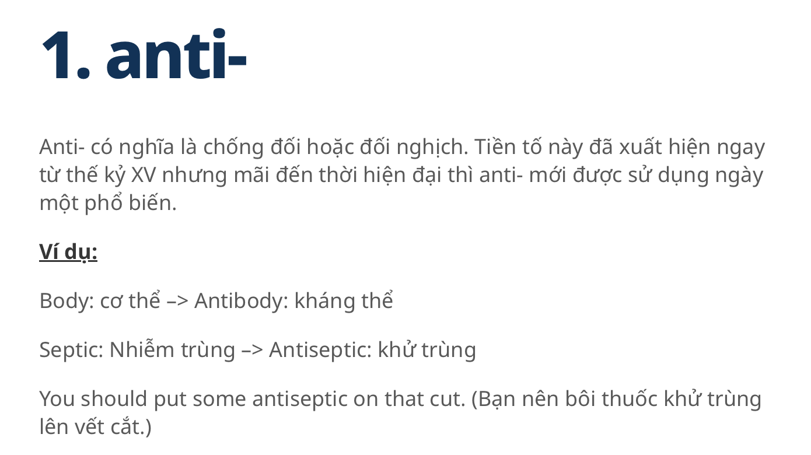
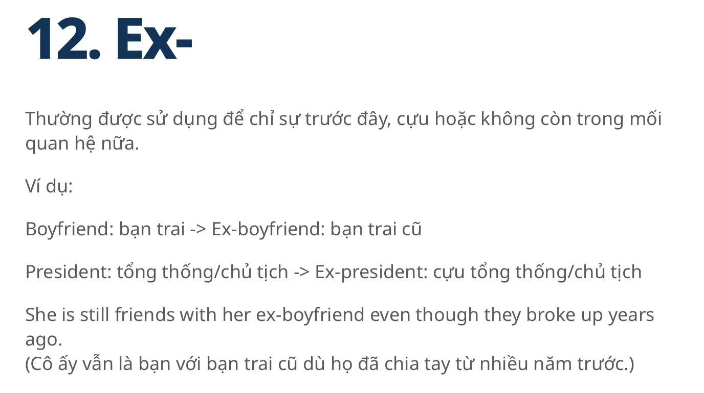
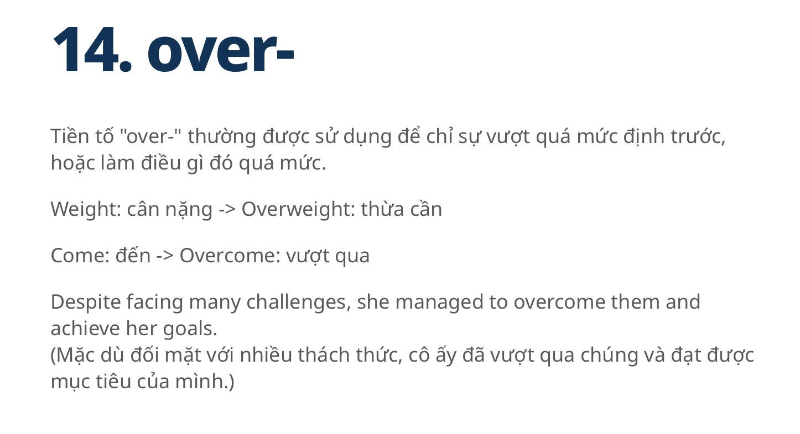
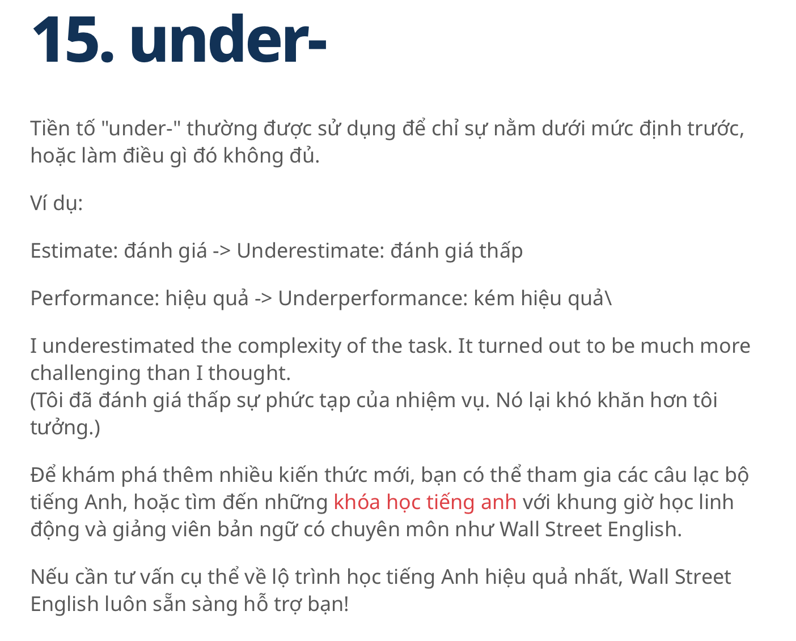

# English for Computer Science (CSE803001-5-1-24(N03))  


Materials for the Class of CSE803001-5-1-24(N03)
# Part I. Lecturing about Memory
## 1. Brief Introduction


### Definition

Memory is an Electronic holding place for the instructions and data.
It is used by the computer's operating system, hardware, and software.

### Classification

1. Primary Memory
   Located directly on microchips on the motherboard that physically close to a computer's microprocessor.

Memory is used as a synonym for primary memory 

   For example: RAM

2. Secondary Memory (Second storage device)

   For example: A hard drive or a hard disk drive (HDD)
   
   

### Comparision

|Items| Primary Memory           | Secondary Memory [Storage] | 
| :---------------- | :------: | :------: | 
|Data storage|     volatile| nonvolatile |
||    Short time  | Long Time |
||    Gone after power-off  | Remain |
|Performance| Fast|Slow|

## 2. 


# Part II. Required Reading Materials: Memory


Changing Trends in Computer Architecture: A Comprehensive Analysis of ARM and x86 Processors
Gupta, K. and Sharma, T., 2021. Changing trends in computer architecture: A comprehensive analysis of arm and x86 processors. International Journal of Scientific Research in Computer Science, Engineering and Information Technology, 7.


# Part III. Listening Materials: Memory


## Memory Brief Introduction

[](https://www.youtube.com/watch?v=H_M--weEzpA&t=119s)

[](https://www.youtube.com/watch?v=vqs_0W-MSB0)


  
# Part III. Writing 
## Writing Technique of POWER

This new strategic technique is called the Power strategy. 
This strategy contains the following steps:

1. "P" which stands for picking ideas. In this stage, students are asked to think of what they are writing and this stage is considered to be pre-writing stage then students write freely and then choose the most important ideas to write about.
   
2. "O" refers to organizing ideas. In this stage, students put their ideas into well-organized order according to the sequence and the importance of the ideas.
   
3. "W" stands for writing and this stage is the stage of actual writing to what had been arranged before.
   
4. "E" means evaluating what had been written according to a writing rubric see appendix (A) and your supporting/evidence/experiment results.
   
5. "R" means re-examining and rereading what had been written to make sure of its quality.


   
## Writing Technique of Tone (Zobel, Justin, 2005)

+ Objective
  
+ Accurate
  
## Writing Technique of Good Style (Zobel, Justin, 2005).

+ Tone (Objective and Accurate)
+ Examples
+ Motivation
+ Balance
+ Voice (Active)
+ Reference and Citation

## Writing Avoidance
+ Straw man
+ Analogies
+ Obfuscation (Ambiguous)
+ The upper hand
  


## Short_paper

<h1>Writing Materials: CPU</h1>

```
Gupta, K. and Sharma, T. (2021) said "The shift in the industry towards ARM processors can change how we write softwares which in turn will affect the whole software development environment."

Please write a short paper to explain and discuss these points of view. 

Reference:  Changing Trends in Computer Architecture(Gupta, K. and Sharma, T., 2021)

```


```
On page 26 of the book "ARM System of Chip Architecture" (The University of Manchester, n.d), it said "one of the drawbacks of RISC is when the processor incorporates an on-chip cache of a particular size, poor code density results in a smaller proportion of the working set being held in the cache at any time, increasing the cache miss rate, resulting in an even greater increase in the main memory bandwidth requirement and consequent power consumption."

Using the writing techniques of POWER, Good Style (Zobel, Justin, 2005) and  "so-called myth" of Linguistic injustice (Englander Karen, 2019, p.30), to research how Apple Chip can reduce power and have power efficiency in their model. 


```

# Vocabulary
 
   Look up the vocabulary and Explanation.
   Example

| Words            | Meaning | Category|
| :---------------- | :------: | ----: |
| volatile |     |  |
| nonvolatile|     |  |
| Chip-level|     |  |
| Real-time |     |  |
| Logic gates|     |  |
| GPU|     |  |
| quantum-safe system |    |  |
| stochastic [stəˈkastik]|     |  |
| ARM  |     |  |
| x86 |    |  |
| ultra-high frequency pipeline design |     |  |
| self-modifying code |     |  |
| random graph |     |  |
| bipartite [bīˈpärˌtīt] graph |     |  |
| High-Level understanding of the microprocessor core |     |  |
| Branch Prediction Unit |     |  |
| System on Chip|     |  |
| On-chip Integrated Deflate Accelerator|     |  |
| On-chip Integrated Artificial Intelligence Accelerator |     |  |
| zero downtime|     |  |
| redundancy|     |  |
| system-on-chip (SoC /ˌˈɛsoʊsiː/; pl. SoCs /ˌˈɛsoʊsiːz/)|     |  |
| |     |  |
| |     |  |
| |     |  |

# Speaking materials: CPU [Practice]
## Conversation


3.1 Conversation: Discuss the type of CPU  that you bought recently

| Name            | Role | Conversation|
| :---------------- | :------: | ----: |
| Nhat | Listener   |  |
| Lan |  Speaker about your current CPU   |  |
| Duyen |     | Friend to share Conversation |


3.2 Conversation: Now mentioning which ARM and/or x86 can boost you in work, and its advance.

| Name            | Role | Conversation|
| :---------------- | :------: | ----: |
| Bao | Listener    |  |
| Van |     | Speaker Which ARM or x86 can boost your software development.  |

3.3 Conversation: Finally, mentioning about System on Chip CPU.

| Name            | Role | Conversation|
| :---------------- | :------: | ----: |
| Bao | Listener    |  |
| Van |     | Speaker whether System on Chip CPU is CPU inside CPU ?.  |

# Comprehensive / Advanced Exercises

# Grammar Lesson

Prefix in English (Tiền tố trong tiếng Anh)

| Prefix/Meaning            |Prefix/Meaning | Prefix/Meaning|
| :---------------- | :------: | ----: |
|  |      |   |
|  |      |   |
|  |      |   |
|  |      |   |
|  |      |   |

| more... |  


# Reference

1. John Burek & Michael Justin Allen Sexton, 2024.  "The Best CPUs for 2025". Retrieved from https://www.pcmag.com/picks/the-best-cpus
2. Apple.com, 2025. "M4 Max". Retrieved from https://www.apple.com/newsroom/2024/10/apple-introduces-m4-pro-and-m4-max/
3. Intel.com, 2025. "Intel® Core™ Desktop Processors" Retrieved from https://www.intel.com/content/www/us/en/products/docs/processors/core/core-14th-gen-desktop-brief.html
4. Changing Trends in Computer Architecture: A Comprehensive Analysis of ARM and x86 Processors
Gupta, K. and Sharma, T., 2021. Changing trends in computer architecture: A comprehensive analysis of arm and x86 processors. International Journal of Scientific Research in Computer Science, Engineering and Information Technology, 7.
5. Karen, Englander, 2019. English for research publication purposes : critical plurilingual pedagogies /, Routledge
6. Zobel, Justin, 2005. Writing for computer science, Springer.
7. The University of Manchester, n.d., "ARM system on Chip". Retrieved from http://www.cs.man.ac.uk/amulet/publications/books/ARMsysArch

# Hanoi, January 2025  
